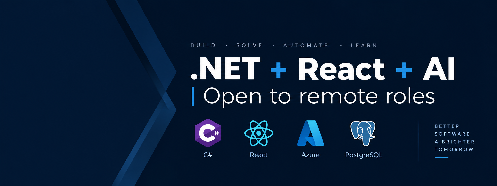

<p align="center">
  
</p>

```
$ whoami
```

<h1 align="center"> Hi there, I'm <a href="https://www.linkedin.com/in/kunal-softwaredev/">Kunal</a> 👋</h1>

<p align="center">
  <a href="https://kunalofficialportfolio.netlify.app/">Portfolio</a> -
  <a href="https://www.linkedin.com/in/kunal-softwaredev/">LinkedIn</a> -
  <a href="https://github.com/skunal012">GitHub</a> -
  <a href="#-cat-varlogexperiencelog">Experience</a> -
  <a href="#-ls-projects">Projects</a> -
  <a href="mailto:skunal012@gmail.com">Contact me.</a>
</p>

<p align="center">
  
</p>

-----------------------------------------------------------
👨🏻‍💻 **About Me**
✨ Full-Stack Engineer (.NET) @ LiSEC Automation | Prev. LearningMate, Ascensive<br>
🌱 PSD I certified, 7+ years with **ASP.NET Core, C#, React, TypeScript, PostgreSQL**<br>
🏭 Core engineer on a microservices-based glass-industry optimization platform<br>
⚡ End-to-end feature ownership: backend APIs, React apps, Docker/CI/CD pipelines<br>
🧩 Domains: industrial automation, HRMS/payroll, EdTech<br>
🤝 Open to **remote roles** and **freelance projects**<br>
📫 How to reach me: **[skunal012@gmail.com](mailto:skunal012@gmail.com)** or [LinkedIn](https://www.linkedin.com/in/kunal-softwaredev/)<br>
⚡ Check out my ✨ [Portfolio](https://kunalofficialportfolio.netlify.app/)<br>
🌐 Based in **Dubai, United Arab Emirates**<br>

<b>🛠 Tech Stack/ Certifications</b><br><br>
Languages: &nbsp;
&nbsp;
&nbsp;
&nbsp;
&nbsp;
&nbsp;
&nbsp;<br>
Backend: &nbsp;
&nbsp;
&nbsp;
&nbsp;
&nbsp;
&nbsp;<br>
Frontend: &nbsp;
&nbsp;
&nbsp;
&nbsp;
&nbsp;
&nbsp;
&nbsp;<br>
Databases: &nbsp;
&nbsp;
&nbsp;<br>
Testing: &nbsp;
&nbsp;
&nbsp;<br>
DevOps and Tools: &nbsp;
&nbsp;
&nbsp;
&nbsp;
&nbsp;<br>
Observability: &nbsp;
&nbsp;
&nbsp;<br>
AI-Assisted Dev: &nbsp;
&nbsp;
&nbsp;<br>

## Certification Badges 🪶
<p align="center">
  
  
</p>

<p align="center">
  
</p>

<details>
<summary><b>🐍 Contribution Snake</b></summary><br>
<p align="center">
  
</p>
</details>

<details>
<summary><b>⚙️ GitHub Analytics</b></summary><br>
<p align="center">
  
  
</p>
<p align="center">
  
</p>
<p align="center">
  
</p>
</details>

<details>
<summary><b>🏆 Coding Activity</b></summary><br>
<p align="center">
  
  
  
</p>
</details>

---

## `$ cat /etc/system-release`

```
Name:       Kunal
Role:       Full-Stack Engineer (.NET)
Cert:       Professional Scrum Developer I (PSD I)
Experience: 7+ years
Location:   Dubai, United Arab Emirates
Status:     Open to remote roles
Motto:      Better software, a brighter tomorrow
```

## `$ cat /var/log/experience.log`

<details open>
<summary><b>🏭 LiSEC Automation Middle East FZ-LLC</b> | Software Developer | Dubai, UAE | Sept 2022 – Present</summary><br>

- Architected and maintained four .NET microservices with EF Core, PostgreSQL, and OpenAPI-first contracts as core engineer on a glass-rack optimization platform.
- Engineered a parallel beam-search optimizer with thread-safe shared caches, index-keyed result ordering, and idempotent finalization, cutting optimization runtime by **40–60%** on large orders with full run-to-run determinism.
- Built three React 19 + TypeScript + Vite apps, including a drag-and-drop rack editor (@dnd-kit, undo/redo, 2D SVG + 3D Three.js, SignalR real-time sync) holding **60fps with 100+ racks**.
- Delivered platform and DevOps tooling: OpenAPI-codegen typed clients, dual auth (OIDC JWT + gRPC service tokens), reusable GitHub Actions CI templates, docker-compose/nginx deployment with Datadog + OpenTelemetry + Elastic APM.

`C#` `.NET 8/10` `ASP.NET Core` `React 19` `TypeScript` `PostgreSQL` `EF Core` `SignalR` `gRPC` `Docker` `GitHub Actions` `Three.js` `Datadog`
</details>

<details>
<summary><b>📚 LearningMate</b> | Software Engineer | Kolkata, India | Sept 2021 – Aug 2022</summary><br>

- Developed and optimized RESTful APIs with C# and ASP.NET Core for performance and scalability.
- Designed MS SQL Server databases and React.js interfaces across EdTech platforms.
- Improved delivery speed by **40%** with CI/CD automation, Agile practices, and code reviews.
- Designed database transaction test scenarios to verify claims, payroll, and employee records.

`ASP.NET Core` `React.js` `C#` `MS SQL Server` `Git` `Azure`
</details>

<details>
<summary><b>💼 Ascensive Technologies</b> | Software Developer | Noida, India | Jun 2019 – Sept 2021</summary><br>

- Led end-to-end delivery of an HRMS and Payroll application (ASP.NET WebForms/MVC, MS SQL Server), from requirements to IIS deployment.
- Optimized database performance with complex SQL queries and stored procedures.
- Achieved **30%** better delivery efficiency through tailored customizations and streamlined versioning for cloud and on-premise setups.

`ASP.NET MVC` `ASP.NET Web Forms` `ASP.NET Web API` `C#` `MS SQL Server`
</details>

## `$ ls ~/projects`

| Project | Domain | What it does |
|:--------|:-------|:-------------|
| **Glass Rack Optimization Platform** | Industrial automation | Rules-driven engine that plans how glass items load onto transport racks, with a 2D/3D planner editor |
| **Order Management System** | Manufacturing | Web app for orders, quotations, and credit notes, connecting a modern React UI to existing backend services |
| **Delivery Planning & Tracking** | Logistics | Multi-tenant delivery planning with truck load plans, a map view, a QR driver flow, and live updates |
| **Document Layout Designer** | Manufacturing | React + ASP.NET Core designer for printable production document layouts, with print preview |
| **Leave Management** | HR, personal | Leave requests and approval workflows. ASP.NET Core APIs, React + Ant Design UI, CI/CD, deployed on Azure |

## `$ cat /etc/education.conf`

```
Degree:     B.Tech, Computer Science and Engineering
University: Maulana Abul Kalam Azad University of Technology (MAKAUT)
CGPA:       8.12 / 10
Years:      Aug 2015 – Jun 2019
```

## `$ cat /etc/practices.conf`

```
Agile/Scrum | TDD | SOLID | DDD | OOP | OpenAPI-First Design
```

## `$ cat /etc/contact.conf`

<a href="https://kunalofficialportfolio.netlify.app/"></a>
<a href="https://www.linkedin.com/in/kunal-softwaredev/"></a>
<a href="https://github.com/skunal012"></a>
<a href="mailto:skunal012@gmail.com"></a>

---

```
$ uptime
Build · Solve · Automate · Learn. Better software, a brighter tomorrow.
```

<p align="left">
  
  <a href="https://github.com/skunal012?tab=followers"></a>
  <a href="https://github.com/skunal012?tab=repositories"></a>
</p>

<p align="center">
  
</p>

<p align="center">
  Do you want to contact me for collaboration opportunities? ⟶ <a href="https://kunalofficialportfolio.netlify.app/">Portfolio</a>, <a href="https://www.linkedin.com/in/kunal-softwaredev/">LinkedIn</a> or <a href="mailto:skunal012@gmail.com">skunal012@gmail.com</a><br>
  <b>Show some ❤️ by starring some of the repositories!</b>
</p>
